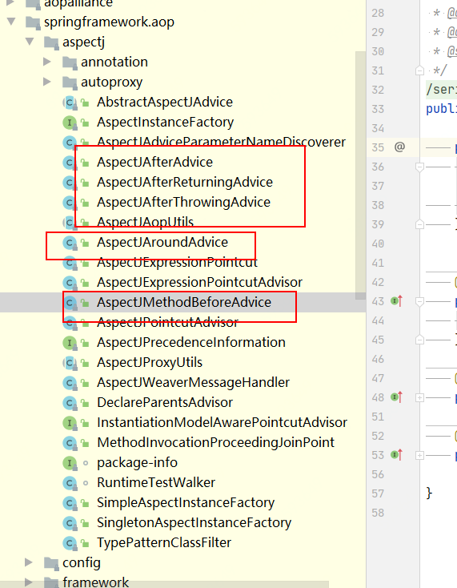

###AspectJAutoProxyBeanDefinitionParser
org.springframework.aop.config.AspectJAutoProxyBeanDefinitionParser

public static void registerAspectJAnnotationAutoProxyCreatorIfNecessary(
			ParserContext parserContext, Element sourceElement) {
        //注册或升级 beanName
		BeanDefinition beanDefinition = AopConfigUtils.registerAspectJAnnotationAutoProxyCreatorIfNecessary(
				parserContext.getRegistry(), parserContext.extractSource(sourceElement));
		//处理 proxy-target-class以及		expose-proxy
		useClassProxyingIfNecessary(parserContext.getRegistry(), sourceElement);
		//注册组件并通知
		registerComponentIfNecessary(beanDefinition, parserContext);
	}
	//如果已经存在了自动代理创建器且存在的自动创建代理器与现在的不一致，那么要根据优先级判断使用哪个
	org.springframework.aop.config.AopConfigUtils.registerOrEscalateApcAsRequired
	
	
	org.springframework.aop.framework.autoproxy.AbstractAutoProxyCreator.postProcessAfterInitialization
	if (bean != null) {
    			Object cacheKey = getCacheKey(bean.getClass(), beanName);
    			if (this.earlyProxyReferences.remove(cacheKey) != bean) {
    				return wrapIfNecessary(bean, beanName, cacheKey);
    			}
    		}
    		return bean;
    		//获取增强的方法或增强器2
	Object[] specificInterceptors = getAdvicesAndAdvisorsForBean(bean.getClass(), beanName, null);
    		if (specificInterceptors != DO_NOT_PROXY) {
    			this.advisedBeans.put(cacheKey, Boolean.TRUE);
    			//根据获取的增强进行代理
    			Object proxy = createProxy(
    					bean.getClass(), beanName, specificInterceptors, new SingletonTargetSource(bean));
    			this.proxyTypes.put(cacheKey, proxy.getClass());
    			return proxy;
    		}

		
    		